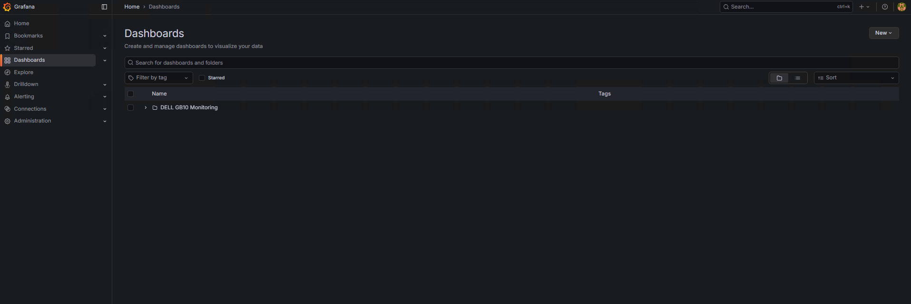
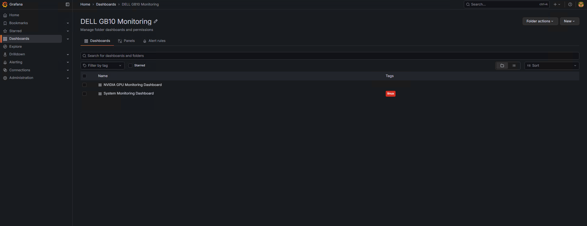
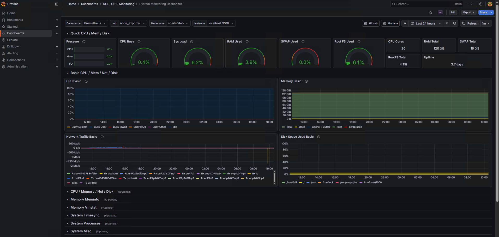
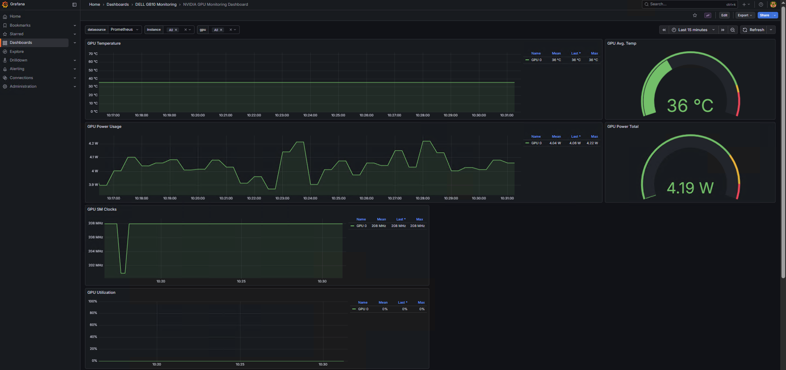

# 🖥️ monitoring-ansible

> **Ansible 기반 모니터링 스택 자동 배포 프로젝트**  
> Prometheus, Grafana, Node Exporter, DCGM Exporter를 활용한 시스템 및 GPU 모니터링 환경을 자동으로 구성합니다.

## 📋 목차
- [사용법 한눈에 보기](#-사용법-한눈에-보기)
- [프로젝트 구조](#-프로젝트-구조)
- [주요 기능](#-주요-기능)
- [디버깅](#-디버깅)
- [커스터마이징](#-커스터마이징)
- [배포 내용](#-배포-내용)
- [메트릭 정보](#-gb10이-실제로-수집하고-있는-메트릭-11개)
- [Grafana 대시보드](#-grafana--dell-gb10-monitoring-dashboard)

---

## 🚀 사용법 한눈에 보기
아래 순서대로 실행하면 로컬에서 제공하는 ansible-control 컨테이너를 통해 모니터링 노드를 자동 구성할 수 있습니다.

> 📌 **사전 준비**: Ansible을 실행할 호스트에 Docker가 설치되어 있어야 합니다.

### 1) 컨테이너 이미지 준비
```bash
# ansible-control 이미지를 로컬에서 빌드
docker build -t ansible-control:local ansible-control/

# docker-compose.yml 의 image 태그도 동일한 이름으로 맞춰둡니다.
```

### 2) Ansible 컨테이너 시작
```bash
docker compose up -d
docker exec -it ansible-control bash
```

### 3) 인벤토리 설정
컨테이너 내부(`/workspace`)에서 인벤토리 파일을 편집합니다:
```bash
vi ansible/inventory/hosts.ini
```

**인벤토리 예시:**
```ini
[monitoring_server]
monitoring ansible_host=10.0.0.10 monitoring_compose_dir=/app/monitoring prometheus_data_dir=/data/prometheus grafana_data_dir=/data/grafana

[monitored_nodes]
node1 ansible_host=10.0.0.11
node2 ansible_host=10.0.0.12

[gpu_nodes]
gpu1 ansible_host=10.0.0.21 dcgm_exporter_enabled=true
gpu2 ansible_host=10.0.0.22 dcgm_exporter_enabled=true
```

- `monitoring_server`: Prometheus + Grafana가 설치될 모니터링 서버
- `monitored_nodes`: Node Exporter가 설치되어 메트릭을 수집할 대상 노드들
- `gpu_nodes`: NVIDIA GPU가 있는 노드 (dcgm_exporter_enabled=true 설정 시 DCGM-Exporter 배포)

### 4) 플레이북 실행
```bash
cd ansible
ansible-playbook -i inventory/hosts.ini playbooks/deploy-monitoring.yml
```

### 5) 서비스 접속
- **Prometheus**: `http://<monitoring 노드 IP>:9090`
- **Grafana**: `http://<monitoring 노드 IP>:3000`
  - 기본 로그인: `admin / admin`
- **Node Exporter**(각 노드): `http://<노드 IP>:9100/metrics`

| 서비스 | 기본 포트 | 비고 |
| --- | --- | --- |
| Prometheus | 9090 | 메트릭 수집/탐색 |
| Grafana | 3000 | Node Exporter Full 대시보드 자동 등록 |
| Node Exporter | 9100 | 시스템 메트릭 수집 |
| DCGM-Exporter | 9400 | NVIDIA GPU 메트릭 수집 (GPU 노드에만 배포) |

> 💡 **대시보드**: Grafana에는 Node Exporter Full 대시보드가 provisioning으로 자동 등록됩니다.

---

## 🧭 프로젝트 구조

```
monitoring-ansible/
├── docker-compose.yml              # Ansible 컨트롤 컨테이너 정의
├── ansible-control/               # Ansible 컨트롤 컨테이너 Dockerfile
│   └── Dockerfile
└── ansible/                       # Ansible 설정 및 플레이북
    ├── ansible.cfg                # Ansible 설정 (roles_path 등)
    ├── inventory/
    │   ├── hosts.ini              # 인벤토리 (서버/노드 정의)
    │   └── group_vars/
    │       └── all.yml            # 전역 변수 (Prometheus URL, 디렉터리 경로 등)
    ├── playbooks/
    │   └── deploy-monitoring.yml  # 메인 배포 플레이북
    └── roles/
        ├── monitoring_server/     # Prometheus + Grafana 역할
        │   ├── tasks/
        │   │   └── main.yml
        │   ├── templates/
        │   │   ├── prometheus.yml.j2
        │   │   ├── docker-compose.yml.j2
        │   │   ├── datasource.yml.j2
        │   │   └── dashboards.yml.j2
        │   └── files/
        │       └── node-exporter-full.json
        ├── node_exporter/         # Node Exporter 역할
        │   └── tasks/
        │       └── main.yml
        └── dcgm_exporter/         # DCGM-Exporter 역할 (GPU 모니터링)
            └── tasks/
                └── main.yml
```

### 주요 파일 설명

- **`ansible/ansible.cfg`**: Ansible 설정 파일. roles 경로를 `./roles`로 지정하여 상대 경로로 역할을 찾을 수 있도록 합니다.
- **`ansible/inventory/hosts.ini`**: 배포 대상 서버 및 노드 정의
- **`ansible/inventory/group_vars/all.yml`**: 모든 호스트에 적용되는 전역 변수 (Prometheus URL, 데이터 디렉터리 경로, Grafana 인증 정보 등)
- **`ansible/roles/monitoring_server/`**: Prometheus와 Grafana를 Docker Compose로 배포하는 역할
  - `prometheus.yml.j2`: Prometheus 설정 템플릿 (동적으로 monitored_nodes와 gpu_nodes를 targets에 추가)
  - `docker-compose.yml.j2`: Prometheus, Grafana, Node Exporter 컨테이너 정의
- **`ansible/roles/node_exporter/`**: 각 모니터링 대상 노드에 Node Exporter 컨테이너를 배포하는 역할
- **`ansible/roles/dcgm_exporter/`**: NVIDIA GPU가 있는 노드에 DCGM-Exporter 컨테이너를 배포하는 역할 (dcgm_exporter_enabled=true인 경우에만)

---

## 🔧 주요 기능

### 동적 타겟 구성
Prometheus 설정은 Jinja2 템플릿으로 생성되며, `inventory/hosts.ini`에 정의된 호스트들을 자동으로 scrape targets에 추가합니다.

- **`[monitored_nodes]`**: Node Exporter 타겟으로 자동 추가
- **`[gpu_nodes]`**: `dcgm_exporter_enabled=true`인 호스트만 DCGM-Exporter 타겟으로 추가

**템플릿 예시 (`prometheus.yml.j2`):**
```jinja
scrape_configs:
  - job_name: 'node_exporter'
    static_configs:
      - targets:
        - 'localhost:9100'


        - '{{ hostvars[h].ansible_host | default(h) }}:{{ hostvars[h].node_exporter_port | default(9100) }}'



  - job_name: 'dcgm_exporter'
    static_configs:
      - targets:


        - '{{ hostvars[h].ansible_host | default(h) }}:{{ hostvars[h].dcgm_exporter_port | default(9400) }}'


```

### 권한 분리
- Prometheus 데이터 디렉터리: `65534:65534` (nobody 사용자)
- Grafana 데이터 디렉터리: `472:472` (Grafana 컨테이너 기본 사용자)

---

## 🐛 디버깅

### 템플릿 렌더링 테스트
Prometheus 설정 템플릿이 올바르게 렌더링되는지 확인:
```bash
cd ansible
ansible monitoring -i inventory/hosts.ini -m template \
  -a "src=roles/monitoring_server/templates/prometheus.yml.j2 dest=/tmp/test.yml" \
  -c local

cat /tmp/test.yml
```

### 변수 확인
특정 호스트의 변수를 확인:
```bash
ansible monitoring -i inventory/hosts.ini -m debug -a "var=prometheus_url"
```

### 플레이북 Dry-run
실제로 변경하지 않고 플레이북 실행 시뮬레이션:
```bash
ansible-playbook -i inventory/hosts.ini playbooks/deploy-monitoring.yml --check --diff
```

---

## 📝 커스터마이징

### 변수 수정
`ansible/inventory/group_vars/all.yml`에서 다음 변수를 수정할 수 있습니다:

```yaml
# Prometheus settings
prometheus_data_dir: "/data/prometheus"
prometheus_image: "prom/prometheus:latest"
prometheus_url: "http://{{ hostvars[groups['monitoring_server'][0]].ansible_host }}:9090"

# Grafana settings
grafana_admin_password: "admin"
grafana_admin_user: "admin"
grafana_data_dir: "/data/grafana"
grafana_image: "grafana/grafana:latest"

# Node Exporter settings
node_exporter_image: "prom/node-exporter:latest"

# DCGM Exporter settings
dcgm_exporter_enabled: false  # 호스트별로 오버라이드 가능
dcgm_exporter_image: "nvcr.io/nvidia/k8s/dcgm-exporter:4.4.2-4.7.0-ubuntu22.04"
dcgm_exporter_port: 9400

# Common settings
monitoring_compose_dir: "/app/monitoring"
```

### 포트 변경
Node Exporter 또는 DCGM-Exporter 포트를 변경하려면 인벤토리에서 호스트별로 변수를 추가:
```ini
[monitored_nodes]
node1 ansible_host=10.0.0.11 node_exporter_port=9101

[gpu_nodes]
gpu1 ansible_host=10.0.0.21 dcgm_exporter_enabled=true dcgm_exporter_port=9401
```

---

## 📦 배포 내용

### Monitoring Server (monitoring_server role)
- **Prometheus**: 메트릭 수집 및 저장
- **Grafana**: 시각화 및 대시보드
- **Node Exporter**: 모니터링 서버 자체의 시스템 메트릭

### Monitored Nodes (node_exporter role)
- **Node Exporter**: 각 노드의 시스템 메트릭 수집 (CPU, 메모리, 디스크, 네트워크 등)

### GPU Nodes (dcgm_exporter role)
- **DCGM-Exporter**: NVIDIA GPU 메트릭 수집 (GPU 사용률, 메모리, 온도, 전력 등)
  - 요구사항: NVIDIA GPU, NVIDIA Driver, Docker with `--gpus` 지원
  - `dcgm_exporter_enabled=true`로 설정된 호스트에만 배포됨

---

## 📘 GB10이 실제로 수집하고 있는 메트릭 (11개)


| No | Metric Name | Friendly Name | 설명 |
|----|-------------|----------------|------|
| 1 | **DCGM_FI_DEV_SM_CLOCK** | SM Clock Frequency | GPU SM(Core) 클럭 속도(MHz) |
| 2 | **DCGM_FI_DEV_MEMORY_TEMP** | Memory Temperature | GPU 메모리 온도(°C), GB10은 0으로 표시될 수 있음 |
| 3 | **DCGM_FI_DEV_GPU_TEMP** | GPU Temperature | GPU 칩 온도 |
| 4 | **DCGM_FI_DEV_POWER_USAGE** | Power Usage | GPU 실시간 전력 사용량(W) |
| 5 | **DCGM_FI_DEV_TOTAL_ENERGY_CONSUMPTION** | Total Energy Consumption | GPU 부팅 이후 누적 에너지 사용량(mJ) |
| 6 | **DCGM_FI_DEV_PCIE_REPLAY_COUNTER** | PCIe Replay Counter | PCIe 오류로 retry 발생한 횟수 (0이면 정상) |
| 7 | **DCGM_FI_DEV_GPU_UTIL** | GPU Utilization | GPU 전체 사용률(%) |
| 8 | **DCGM_FI_DEV_MEM_COPY_UTIL** | Memory Copy Utilization | GPU Memory Copy 엔진 사용률(%) |
| 9 | **DCGM_FI_DEV_ENC_UTIL** | Encoder Utilization | NVENC 인코더 사용률(%) |
| 10 | **DCGM_FI_DEV_DEC_UTIL** | Decoder Utilization | NVDEC 디코더 사용률(%) |
| 11 | **DCGM_FI_DEV_VGPU_LICENSE_STATUS** | vGPU License Status | vGPU 라이선스 활성 여부 |

---

## ❌ GB10에서 현재 수집되지 않는 메트릭 (15개)

| No | Metric Name | Friendly Name | 설명 |
|----|-------------|----------------|------|
| 1 | **DCGM_FI_DEV_MEM_CLOCK** | Memory Clock Frequency | GPU 메모리 클럭(MHz), NVML에서 미지원 |
| 2 | **DCGM_FI_DEV_XID_ERRORS** | XID Error Code | GPU 오류 코드, 오류 발생 시에만 값 출력 |
| 3 | **DCGM_FI_DEV_FB_FREE** | Framebuffer Free Memory | 사용 가능한 VRAM, GB10은 미지원 |
| 4 | **DCGM_FI_DEV_FB_USED** | Framebuffer Used Memory | 사용 중 VRAM, GB10은 미지원 |
| 5 | **DCGM_FI_DEV_FB_RESERVED** | Framebuffer Reserved Memory | 예약된 VRAM, GB10은 미지원 |
| 6 | **DCGM_FI_DEV_NVLINK_BANDWIDTH_TOTAL** | NVLink Total Bandwidth | GB10은 NVLink 하드웨어 없음 |
| 7 | **DCGM_FI_DEV_UNCORRECTABLE_REMAPPED_ROWS** | Uncorrectable Remapped Rows | 수정 불가 메모리 오류로 remap된 row 수, ECC 미지원 |
| 8 | **DCGM_FI_DEV_CORRECTABLE_REMAPPED_ROWS** | Correctable Remapped Rows | 수정 가능한 오류로 remap된 row 수, ECC 미지원 |
| 9 | **DCGM_FI_DEV_ROW_REMAP_FAILURE** | Row Remap Failure | row remap 실패 여부, ECC 미지원 |
| 10 | **DCGM_FI_DRIVER_VERSION** | Driver Version | GPU 드라이버 버전, DCGM 4.x에서 label 비활성 |
| 11 | **DCGM_FI_PROF_GR_ENGINE_ACTIVE** | Graphics Engine Active Ratio | Graphics 엔진 활성 비율, Profiling 모듈 미활성 |
| 12 | **DCGM_FI_PROF_PIPE_TENSOR_ACTIVE** | Tensor Core Active Ratio | Tensor/HMMA 파이프 활성 비율, Profiling 미지원 |
| 13 | **DCGM_FI_PROF_DRAM_ACTIVE** | DRAM Active Ratio | DRAM 인터페이스 활성 비율, Profiling 미지원 |
| 14 | **DCGM_FI_PROF_PCIE_TX_BYTES** | PCIe TX Rate | PCIe 전송 대역폭(Bytes/s), Profiling 기반 기능 비활성 |
| 15 | **DCGM_FI_PROF_PCIE_RX_BYTES** | PCIe RX Rate | PCIe 수신 대역폭(Bytes/s), Profiling 기반 기능 비활성 |

---

## 📊 Grafana – DELL GB10 Monitoring Dashboard

아래는 Grafana에서 GB10 시스템 및 GPU 모니터링 대시보드를 확인하는 순서입니다.

---

### **1. Grafana 접속 후 "DELL GB10 Monitoring" 선택**



---

### **2. 시스템 모니터링 또는 GPU 모니터링 대시보드 선택**



---

### **3. 시스템 모니터링 대시보드 (System Monitoring Dashboard)**



주요 정보:
- CPU / Memory / Disk 사용률
- 네트워크 트래픽
- Load Average, Uptime
- Processes, Timesync, Meminfo 등 상세 OS 메트릭

---

### **4. GPU 모니터링 대시보드 (NVIDIA GPU Monitoring Dashboard)**



주요 정보:
- GPU Temperature
- GPU Power Usage
- GPU SM Clock
- GPU Utilization
- Memory Copy/Encoder/Decoder Utilization

---

## ✔ 요약

- **DELL GB10 Monitoring 폴더**에서 시스템/ GPU를 각각 모니터링 가능  
- NVIDIA DCGM Exporter 기반 GPU 메트릭 실시간 시각화  
- Node Exporter 기반 시스템 전체 OS 레벨 모니터링 가능  
